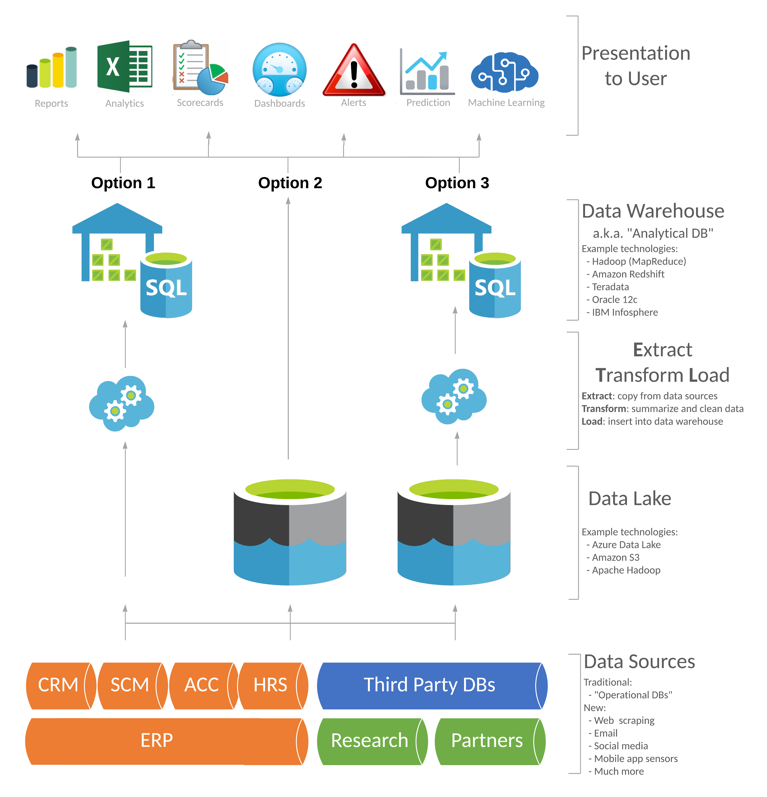

# ETL - an end to end ELT data pipeline
A repository to demonstrate some of the main concepts behind data engineering using open source tools such as Airflow, DBT, great expectations, PostgreSQL and Redash in order to perform and end to end ELT data pipeline.


## ELT 


**Table of contents**

- [Overview](#overview)
- [Objective](#objective)
- [Requirement](#requirement)
- [DBT help](#DBT-help)
- [Documentation](#documentation)
- [Install](#install)
- [Data](#data)
- [Features](#features)
- [How to use the API](#examples)
- [Pipelines](#pipelines)
- [Notebooks](#notebooks)
- [Scripts](#scripts)
- [Test](#test)
- [Author](#author)


## Overview
> In the current state of our world, data plays a very huge role in almost everything we do. Data is everywhere, large volumes of data, forming many different types, are generated from many different sources and from a wide array of locations, very rapidly. Not making sense of this valuable resource (if not the most valuable resource) would not only be foolish but also very expensive.


## Objective
> The main objective of this startup is to help the organization obtain critical intelligence based on public and private data they collect and organize. 
>
> This is going to be achieved by deploying an end to end ELT data pipeline that will extract the required data from several sources of data generation tools listed above, then loading it into a data warehouse in order to later transform the obtained data that can serve the needs of several people in the organization's staff like data scientists, machine learning engineers, business and data analysts as well as several reporting staff members


## Major requirements
> Python 3.5 or above
> 
> Pip
> 
> Airflow
> 
> DBT 
> 
> PostgreSQL
> 
> Redash


## DBT-help
Welcome to your new dbt project!

### Using the starter project

Try running the following commands:
- dbt run
- dbt test


### Resources:
- Learn more about dbt [in the docs](https://docs.getdbt.com/docs/introduction)
- Check out [Discourse](https://discourse.getdbt.com/) for commonly asked questions and answers
- Join the [chat](https://community.getdbt.com/) on Slack for live discussions and support
- Find [dbt events](https://events.getdbt.com) near you
- Check out [the blog](https://blog.getdbt.com/) for the latest news on dbt's development and best practices


## Data features and documentation
> A detailed feature descriptions and documentation could be found here.
> The deployed DBT data warehouse documentation can be found here at : [deployed DBT data documentation](http://127.0.0.1:8080/#!/source_list/complete_data_source)


## Install

```
git clone https://github.com/Fisseha-Estifanos/ELT.git
cd ELT
pip install -r requirements.txt
```


## Data
### Dataset used
> The several data sets used in this project could be found here at : [open-traffic](https://open-traffic.epfl.ch/index.php/downloads/)


## Features
### The features found in this dataset are as follows
> - track_id - the track id for the vehicle 
> - type - the type of the vehicle
> - traveled_d - the total distance traveled by the vehicle
> - avg_speed - the average speed of the vehicle
> - lat - the latitude of the vehicle on the given time
> - lon - the longitude of the vehicle on the given time
> - speed -  the speed of the vehicle at the given time
> - lon_acc - the accuracy of the longitude of the vehicle on the given time
> - lat_acc - the accuracy of the latitude of the vehicle on the given time
> - time - the time of the data record
> - trackings - the trajectory trackings of the specific track id (vehicle)


## Examples
>
>
>


## Pipelines
> Several numbers of pipelines are going to be used in this project. The main pipeline that is going to be the main end to end ELT data pipeline is going to be formed using Airflow.  
> 1. Airflow DAGs: in order to orchestrate the whole end to end ELT dat a pipeline
> These DAGs could be found under the folder airflow_dags


## Notebooks
> The EDA notebook demonstration can be found here in the form of an .ipynb file, in the notebooks folder.


## Scripts
> All the modules for the EDA notebooks, analyses, helpers and any other scripts will be found here.


## Tests
> All the unit and integration tests are found here in the tests folder.


## Author
> 👤 **Fisseha Estifanos**
>
> - GitHub: [Fisseha Estifanos](https://github.com/fisseha-estifanos)
> - LinkedIn: [Fisseha Estifanos](https://www.linkedin.com/in/fisseha-estifanos-109ba6199/)
> - Twitter: [Fisseha Estifanos](https://twitter.com/f0x__tr0t)


## Show us your support
> Give us a ⭐ if you like this project, and also feel free to contact us at any moment.